# A2Z Agent Hire

A local-first, inspectable job-and-outcome contract for **human-controlled agent work**. It gives a buyer a way to state the job, review worker applications, select one worker, require evidence, record human acceptance, and inspect estimated unit economics. The included replay and data are synthetic; this is a reference implementation, not a live hiring marketplace.

The architecture is documented in [docs/ARCHITECTURE.md](docs/ARCHITECTURE.md), with eleven GitHub-compatible Mermaid diagrams covering the workflow, state machine, data and evidence model, routing, economics, hosted target, trust zones, and links to the wider A2Z ecosystem.

## Why this exists

Agent marketplaces often count task completion as success. A2Z Agent Hire makes an explicit distinction:

```mermaid
flowchart LR
  Job[Job contract] --> Apply[Worker application]
  Apply --> Select[Named human selection]
  Select --> Replay[Synthetic replay]
  Replay --> Evidence[Declared evidence digest]
  Evidence --> Accept[Named human acceptance]
  Accept --> Outcome[Accepted or unresolved]
  Outcome --> Economics[Estimated economics]
```



The reference refuses to launch without selection and keeps a run unresolved when required evidence is missing. It records who declared a digest but does **not** verify the source artifact or the claimed identity. That distinction is central to the design.

## Run locally

Python 3.11+ and the standard library are sufficient:

```bash
python3 -m venv .venv
.venv/bin/python -m apps.api.server --db /tmp/a2z-agent-hire.db --port 8787
```

Open [http://127.0.0.1:8787](http://127.0.0.1:8787). The server binds loopback only because it has no authentication. The dashboard lets you create jobs, register worker records, submit applications, select a worker, replay a run, record operator-declared evidence digests, make an acceptance decision, and inspect economics. It is a single-operator local demo, not an internet service.

Run checks:

```bash
python3 -m unittest discover -s tests -v
```

### Reproduce an accepted synthetic outcome

1. On the seeded job, apply the `swarm-review-team` worker.
2. Select its application using a named human reviewer.
3. Route and replay the job. The new run begins `UNRESOLVED`.
4. Record separate 64-character lowercase SHA-256 digest strings for `PLAN_DIGEST` and `SECURITY_EVIDENCE`, naming a verifier other than `swarm-review-team`.
5. Record a named human acceptance. The local record becomes `ACCEPTED`.

These steps show **contract enforcement only**. Entering a made-up digest can satisfy the local reference. No claim about a real plan, security review, worker identity, or accepted customer work follows from this demo.

## What is implemented

| Module | Role | Boundary |
| --- | --- | --- |
| `packages/oss/outcome_exchange/core.py` | SQLite contracts, hiring states, synthetic run, evidence declarations, economics, evolution gate | No authentication, artifact bytes, model execution, or transactions |
| `apps/api/server.py` | Loopback HTTP API | No multi-user authorization |
| `apps/web/index.html` | Local dashboard | No production account or payment UI |
| `packages/oss/outcome_exchange/failure_clinic.py` | Synthetic three-verdict postcondition check | No provider connection |
| `protocols/` | Published JSON shapes | Not yet a fully enforced schema boundary |
| `fixtures/` and `tests/` | Synthetic and unit-level reproducibility | No customer performance claims |
| `packages/commercial/` | Written interface boundary | No hosted commercial service here |

The routing decision is **Laya/Jev-compatible in shape**. Neither model is bundled or called. The “swarm” is a replayable task graph, not a running group of agents. The unit-economics example uses $75 price and $61.50 estimated variable cost to illustrate $13.50 contribution (18%); it is not measured revenue.

## Architecture and delivery map

The detailed [architecture](docs/ARCHITECTURE.md) covers:

- current data flow, explicit human authority, reachable job states, and logical provenance;
- failure semantics, including missing evidence and cloud timeouts;
- exact metric denominators and cost formulas;
- proposed OSS adapters and a separate commercial control plane;
- production trust zones, phased release gates, and unsolved failure modes.

The order of work is: harden versioned contracts and immutable attempts; add bounded executor adapters; verify artifact bytes and reviewer identity; test one consented paid job family with actual costs; then consider multi-tenant hosting and settlement. A marketplace, viral growth, or profitability is not implied by the local reference.

## Agent Failure Clinic: cloud timeout

`fixtures/agent-failure-clinic-cloud-timeout.json` defines a synthetic Terraform-like timeout. The verifier reads a provider-owned postcondition and receipt under one stable `intent_id`; it does not treat an executor's local success signal as proof. Tests distinguish `COMMITTED`, `NOT_COMMITTED`, and `UNRESOLVED`, including local/provider divergence.

## OSS and commercial boundary

The public layer should retain portable job, application, run, evidence, evaluation, and economics semantics, plus conformance tests and synthetic fixtures. A commercial operator may add authenticated tenant isolation, hosted workflows, attested verification, private evaluation packs, enterprise integrations, payment-provider settlement, support, and SLAs. Those are **target capabilities**, not shipped services.

Do not commit customer records, protected employment attributes, payment secrets, private benchmarks, negotiated rates, or credentials. Real employment-impacting, physical-world, biometric, and surveillance tasks require separate legal, safety, fairness, and domain review before deployment.

## Claim limits

A passing test proves behavior of the local code. It does not prove customer outcomes, worker capability, real-world verifier independence, fairness, certification, marketplace liquidity, production readiness, or commercial viability. All seeded worker scores and monetary values are synthetic.
