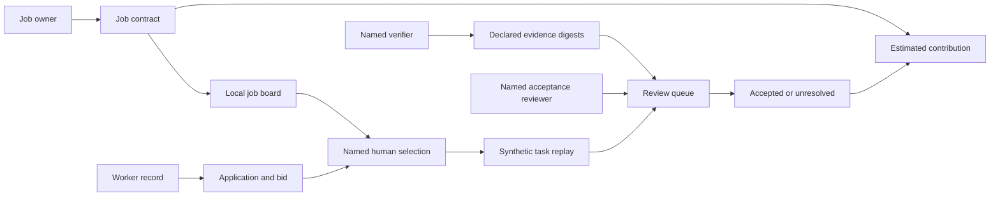
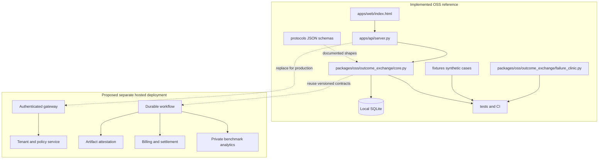
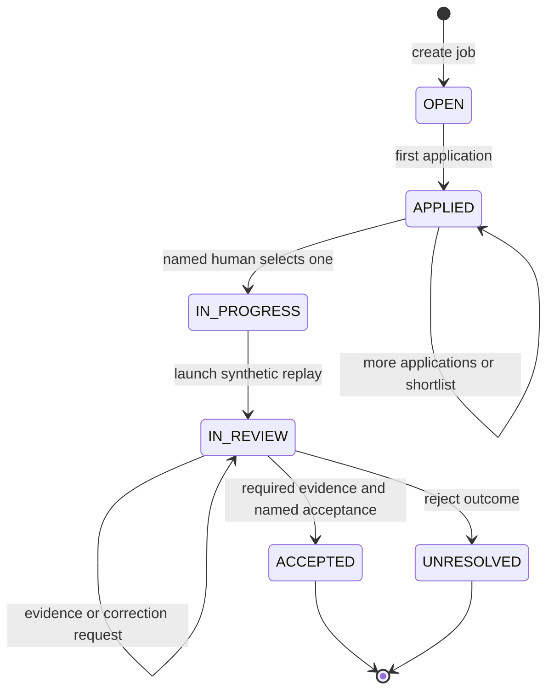
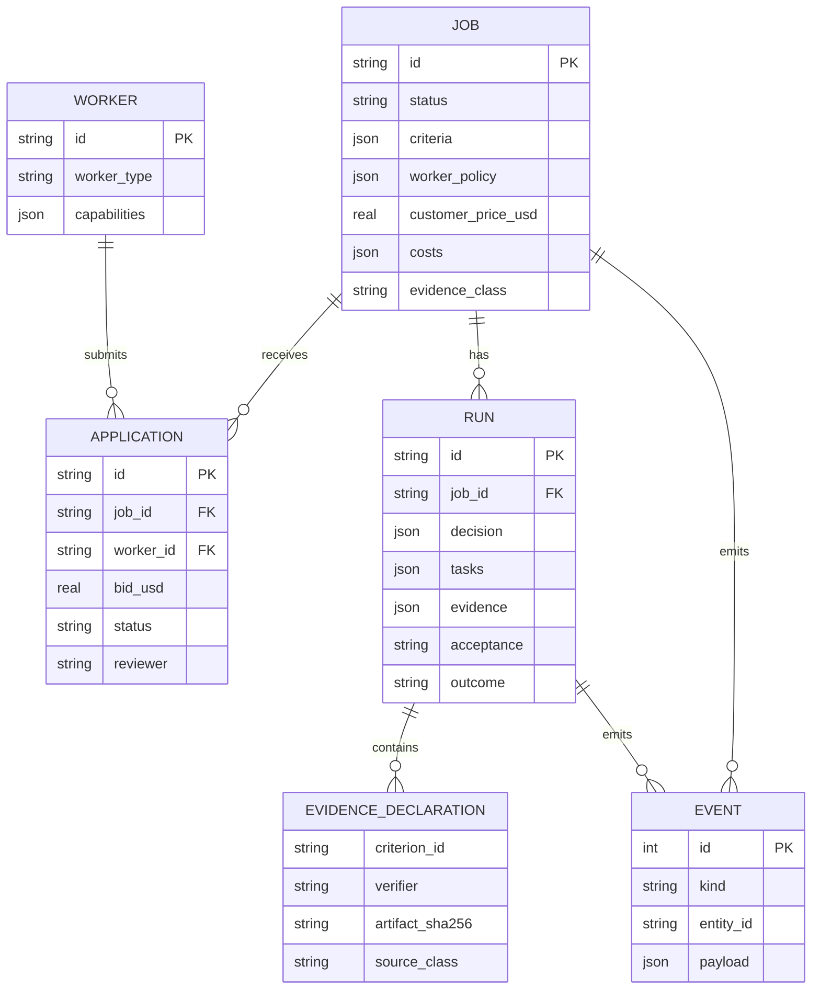
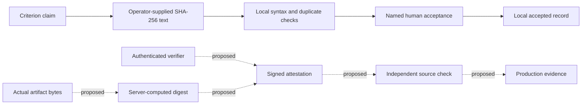
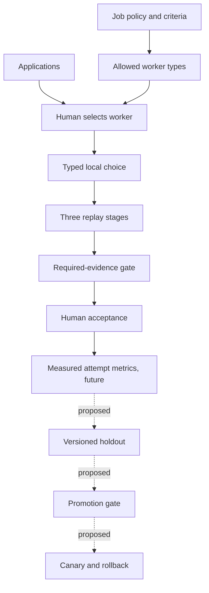
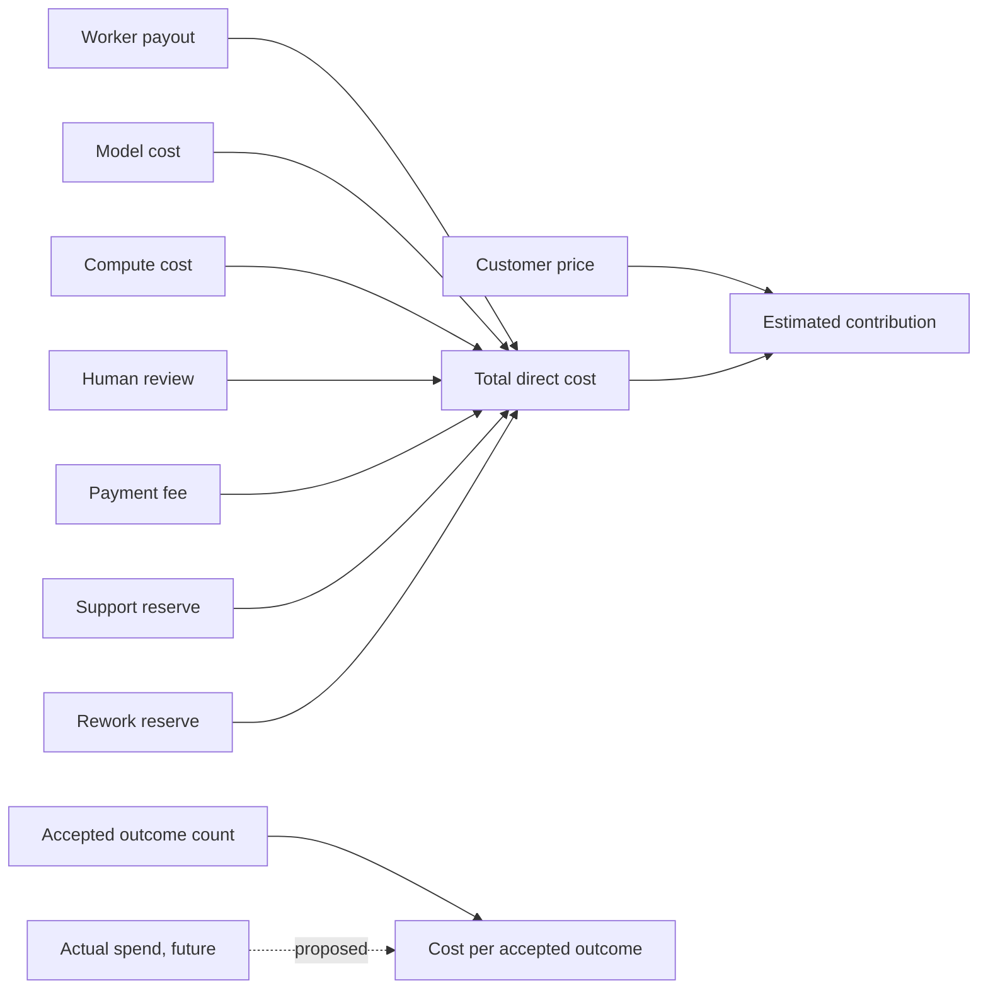
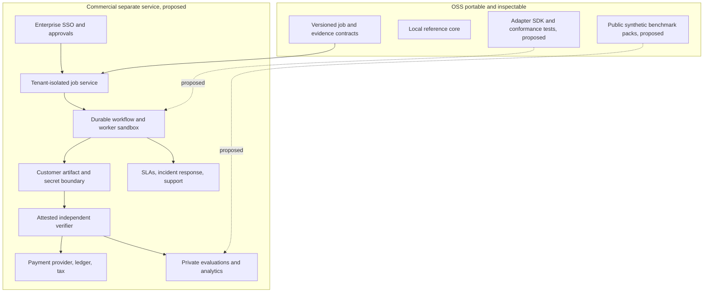
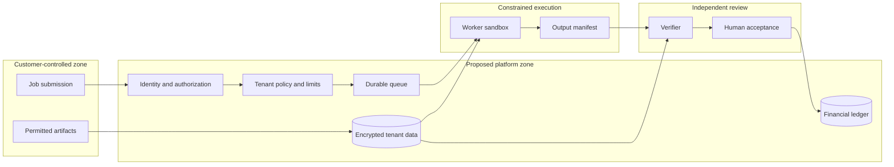
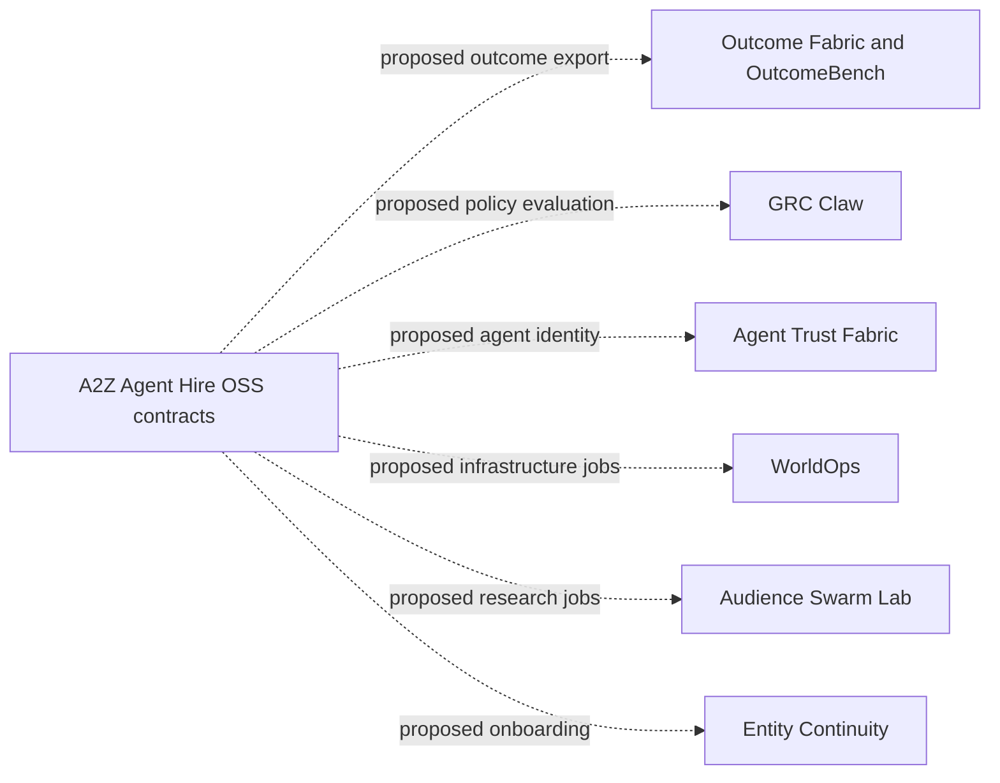

# A2Z Agent Hire: architecture and implementation boundaries

This document separates the **working local OSS reference** from a **proposed hosted product**. The local system is a synthetic contract and workflow demonstration. It does not execute an AI worker, employ a person, attest artifact origin, take payment, or establish a real customer outcome.

## 1. Product contract

A job states an objective, allowed worker types, acceptance criteria, price, and estimated costs. A registered worker applies. A named human selects one application. A replay run describes a task graph. A different named verifier declares evidence digests; a named human accepts or requests correction. The economically meaningful unit is an **accepted outcome**, not a completion flag or a token.



| Capability | Current behavior | Limit |
| --- | --- | --- |
| Board | SQLite jobs, workers, applications, runs, evolution, events | Single local operator; no tenants |
| Human gate | Named reviewer selects one application before launch | Names are text, not authenticated identities |
| Routing | Typed choice with worker options and probabilities | Heuristic shape; no model or calibration |
| Swarm | Deterministic replay stages | No agent execution, tools, or orchestration |
| Evidence | Verifier declares criterion and SHA-256 digest | Digest shape checked; bytes, identity, and truth are not attested |
| Outcome | Required criteria plus named human acceptance | Local record, not third-party certification |
| Economics | Price less seven estimated cost lines | Synthetic or user-declared; no invoices |
| Evolution | Caller-supplied metrics compared with gates | No automatic benchmark execution |
| Failure clinic | Synthetic provider-receipt and postcondition logic | No cloud connection |

## 2. Monorepo and deployable boundaries



The current Python runtime does **not** validate every request against the schemas in `protocols/`. Hosted infrastructure should reuse portable contract semantics while isolating credentials, customer data, private benchmark packs, and settlement.

## 3. Human-controlled workflow

```mermaid
sequenceDiagram
  actor Owner as Job owner
  participant UI as Local UI/API
  participant DB as SQLite core
  actor Candidate as Worker record
  actor Selector as Named human selector
  actor Verifier as Named verifier
  actor Reviewer as Named acceptance reviewer
  Owner->>UI: Create job with criteria and policy
  UI->>DB: Persist OPEN job and event
  Candidate->>UI: Submit proposal and bid
  UI->>DB: Persist PENDING application
  Selector->>UI: Select one application
  UI->>DB: Record reviewer; reject pending alternatives
  UI->>DB: Route to selected worker type
  UI->>DB: Create replay run; outcome UNRESOLVED
  Note over DB: No worker tools run
  Verifier->>UI: Declare criterion, digest, verifier
  UI->>DB: Record OPERATOR_DECLARED evidence
  Reviewer->>UI: Accept, reject, or request correction
  UI->>DB: Check required criteria and named decision
  DB-->>UI: ACCEPTED or UNRESOLVED
  UI-->>Owner: Outcome record and estimated economics
```

When a job requires an independent verifier, the verifier text cannot equal the selected worker ID. This is only a local string comparison. Production independence requires authenticated principals, role separation, ownership checks, and audit-grade review records.



The local reference has no resubmission loop after rejection. `CORRECTION_REQUIRED` retains the current review run so missing evidence can be added; it does not create a new attempt. Production retry must create a new immutable attempt and retain every previous verdict.

## 4. Data and provenance



`EVIDENCE_DECLARATION` is a logical entity stored as JSON inside `runs.evidence`, not a separate SQL table. Events are local chronological records, **not** cryptographically chained or immutable. The schema lacks foreign-key constraints and migrations.



A missing required criterion keeps the outcome unresolved. `HUMAN_ACCEPTANCE` is a decision gate, never a fabricated artifact. A syntactically valid digest does not prove that an artifact exists. The synthetic cloud timeout clinic compares intent ID, desired and baseline states, provider state, and provider receipt. Its three verdicts are `COMMITTED`, `NOT_COMMITTED`, and `UNRESOLVED`; a local executor success signal alone cannot prove commitment.

## 5. Routing, execution, and evolution



Routing returns a Laya/Jev-like decision shape (`type`, `options`, `probabilities`, `selected`, `human_approval_required`). After selection, the application's worker type is authoritative. Probabilities are illustrative heuristic scores, not calibrated forecasts. `create_evolution` evaluates caller-provided numbers and a `holdout_passed` flag; no suite runs automatically. A promoted local candidate is a recorded gate result, not a safe deployment.

For real execution, introduce an adapter interface with input schema, deadline, budget, idempotency key, egress allowlist, artifact manifest, cancellation, and compensation behavior. Evidence checking must remain in a separate process and principal.

## 6. Economics and benchmark definitions



The seeded job uses **illustrative USD assumptions**: price $75; worker $28; model $9.50; compute $3.25; review $10; payment fee $2.25; support reserve $2.50; rework reserve $6. Total estimated cost is **$61.50**, contribution **$13.50**, and contribution margin **18%**. There are no measured charges or completed paid jobs. Cost per accepted outcome is **undefined** when no outcome is accepted. Real margin must also account for acquisition, fixed platform cost, taxes, refunds, disputes, and overhead.

| Metric | Numerator / denominator | Guard |
| --- | --- | --- |
| Application-to-selection | Jobs with selected worker / jobs with application | Segment by job family |
| Time to selection | Selection time minus first application time | Report median, p90, sample count |
| First-pass acceptance | Jobs accepted on first run / first runs reviewed | Corrections and unresolved are failures |
| Evidence completeness | Criteria with declarations / required non-human criteria | Local declarations are not verified truth |
| Independent verification | Authenticated independent checks / accepted runs | Future only |
| Rework rate | Jobs needing correction or rerun / reviewed jobs | Version attempts |
| Cost per accepted outcome | Actual cohort direct cost / cohort accepted outcomes | Undefined for zero denominator |
| Net contribution | Recognized revenue less actual variable cost and refunds | Future ledger-backed metric |
| Dispute rate | Disputed paid outcomes / paid outcomes | Future only |
| Router calibration | Outcome frequency per score bucket versus score | Requires held-out outcomes |

Segment all metrics by job family, worker class, customer cohort, risk class, geography, and policy version. Publish denominators and uncertainty. Synthetic and customer-supplied results are separate populations.

## 7. OSS and commercial target architecture



Commercial value should come from operated reliability, integrations, customer-specific validation, liquidity, and service. Keep public conformance tests for portable semantics. Keep customer data, negotiated rates, credentials, proprietary risk signals, and private benchmark samples outside this repository.



Before hosting, require tenant-scoped authorization, authenticated reviewers, encryption and key lifecycle, per-run resource caps, sandbox and egress policy, artifact scanning, idempotent jobs, immutable attempts, retries and compensation, independent verifier credentials, retention/deletion, payment-provider reconciliation, audit export, backup/restore drills, observability, and incident response. The current HTTP server binds loopback only and is **not** an internet API.

## 8. Wider A2Z ecosystem



None of these edges are implemented here. Start with one export contract and a conformance test; add each adapter only for a real workflow. Physical-world, biometric, surveillance, and employment-impacting work needs a separate risk assessment, lawful data basis, human authority, consent where applicable, and domain-specific validation.

## 9. Delivery phases and exit criteria

| Phase | Work | Release gate |
| --- | --- | --- |
| 0: Local reference | Selection, evidence, acceptance, replay, economics, UI/API tests, truthful docs | One command reproduces synthetic accepted and unresolved cases |
| 1: Contract hardening | Version schemas, enforce validation, migrations, foreign keys, immutable attempts | Malformed records rejected; old fixtures migrate |
| 2: Bounded executor | Adapter SDK, sandbox, budgets, deadlines, cancellation, output manifest | Chaos cases leave no unknown side effects |
| 3: Independent evidence | Server hashes bytes, authenticated verifier, source receipts | Tampered or missing evidence blocks acceptance |
| 4: Consented pilot | One job family, human acceptance, actual costs, dispute path | Cohort denominators and failures reported |
| 5: Hosted tenants | Auth, isolation, queues, telemetry, backup, retention | Security review, recovery drill, SLO tests |
| 6: Marketplace and payments | Provider settlement, contracts, tax/fraud review | Reconciled ledger, dispute runbooks, legal review |

The first commercial proof is a repeatable paid outcome in one narrow job family with measured delivery cost and accountable acceptance. Local demo traffic alone does not establish marketplace demand.

## 10. Failure matrix

| Failure | Expected handling | Current status |
| --- | --- | --- |
| Launch without selected application | Reject | Implemented and tested |
| Multiple selections for one job | Reject later decision | Implemented and tested |
| Disallowed worker type | Reject application | Implemented and tested |
| Missing required evidence | Keep unresolved | Implemented and tested |
| Selected worker self-verifies | Reject when independent check required | String-level check tested |
| Fake digest with no artifact | Block acceptance | **Not implemented** |
| Provider timeout after side effect | Preserve `UNRESOLVED` | Synthetic clinic tested |
| Duplicate queue delivery | Idempotent attempt and settlement | Proposed |
| Reviewer conflict of interest | Authenticated role and ownership check | Proposed |
| Tenant data bleed | Deny cross-tenant access | Proposed |
| Payment chargeback | Reconcile and dispute | Proposed |

Mermaid uses default styling and simple labels to keep the diagrams readable on GitHub in light and dark mode.
