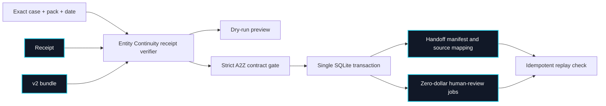

# Entity Continuity import: local operations

A2Z Agent Hire v0.3 accepts **v2 synthetic human-review bundles** exported by [Entity Continuity](https://github.com/AAH20/entity-continuity). It can optionally bind each imported bundle to an independently replayed Entity Continuity v0.5 intake record. This is a local, offline import. It is not a provider marketplace, legal-work order, employment decision, or filing channel.

## Import contract



The importer checks the exact source files, v2 schema, dates, digest, stable job IDs, human-only worker policy, three required acceptance criteria and seven explicit zero-cost fields. It inserts the manifest, foreign-key-bound mappings and jobs in one transaction. A second import returns the recorded job IDs. A changed or incomplete stored job stops replay. The digests bind local bytes; they do not authenticate the customer, reviewer or document origin.

When `--intake-manifest` and `--intake-record` are supplied together, the importer also replays the declared synthetic intake against the same case, pack and date. It requires the intake's embedded receipt to equal the handoff receipt and stores only `intake_record_digest` and `workspace_id` in a foreign-key-bound provenance row. Replay cannot silently omit or change that link. The workspace ID is a namespace, **not tenant isolation**.

## Reproduce with sibling checkouts

Generate a receipt and bundle in Entity Continuity as described in its [integration guide](https://github.com/AAH20/entity-continuity/blob/main/docs/A2Z_AGENT_HIRE_INTEGRATION.md). Then, from this repository:

```bash
PYTHONPATH=.:../entity-continuity/src python3 -m apps.api.import_entity_continuity \
  /tmp/entity-a2z-bundle.json \
  --case ../entity-continuity/examples/egypt-to-us-synthetic-case.json \
  --pack ../entity-continuity/examples/us-de-synthetic-pack.json \
  --receipt /tmp/entity-receipt.json --as-of 2026-09-23 --dry-run
```

After reviewing the IDs and scope, repeat with `--db /tmp/a2z-entity-demo.db` instead of `--dry-run`. To view the local board without demo workers or jobs:

```bash
python3 -m apps.api.server --db /tmp/a2z-entity-demo.db --no-demo-seed --port 8787
```

The server is loopback-only and unauthenticated. Use it only for local reference work. `--no-demo-seed` prevents fictional workers and the seeded cloud job from appearing in a clean database; it does not add production authentication.

To include optional intake provenance, first create and verify `/tmp/entity-intake-record.json` using the [read-only intake protocol](https://github.com/AAH20/entity-continuity/blob/main/docs/READ_ONLY_INTAKE.md). Add these two arguments to both the dry run and actual import commands:

```bash
--intake-manifest ../entity-continuity/examples/synthetic-read-only-intake-manifest.json \
--intake-record /tmp/entity-intake-record.json
```

An intake-linked bundle must be reimported with the same verified intake. Existing unlinked imports are not upgraded by silently attaching a new record; use a reviewed migration or a fresh synthetic database.

## Version migration and recovery

The previous v1 handoff omitted explicit zero-cost fields. Re-export from Entity Continuity v0.5 to obtain v2. The v2 importer **rejects v1** rather than guessing economics. A v1 job already in a local database has no v2 manifest and causes a stable-ID conflict; use a separate clean demo database or plan a reviewed migration. Do not delete customer records to work around a conflict.

On an import failure, the transaction leaves no partial handoff jobs. Keep the original bundle and source files for investigation. Correct the source or contract and regenerate a new receipt and bundle; do not edit a digest by hand. A recorded bundle whose job content or mapping changed is rejected on replay.

## Pilot boundary

The local reference has no user authentication, tenant isolation, trusted source custody, qualified-provider verification, payment settlement, audit-log immutability or legal conclusion engine. Before a customer pilot, use private source storage, a named reviewer, consented and redacted records, an independent baseline, encrypted backups, deletion rules and a manual exception process. The [Entity Continuity pilot runbook](https://github.com/AAH20/entity-continuity/blob/main/docs/PILOT_READINESS.md) defines that scope. None of these controls is implied by a passing unit test.
