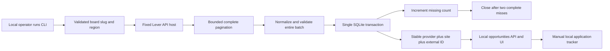
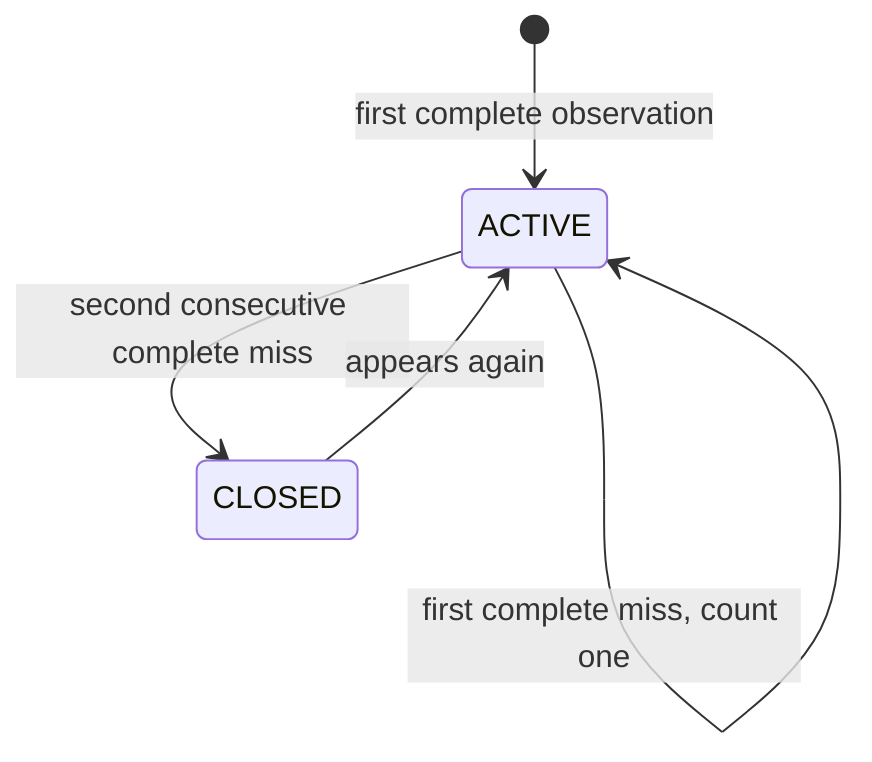

# Opportunity intake: first production-oriented slice

The local reference can import one company's **public Lever postings feed** per command, maintain stable posting IDs, show freshness, and track an application locally. This is a bounded adapter, not a general job crawler, employer identity verifier, candidate account system, or hosted search product. The [Lever-owned Postings API documentation](https://github.com/lever/postings-api) defines the public feed and its global/EU hosts.

## Implemented data path



The importer uses a fixed HTTPS host, a validated board slug, a 10-second request timeout, a 3 MB per-page response limit, at most 100 postings per page, and a configurable maximum of 20 pages. It does not follow redirects or accept arbitrary fetch URLs. It first downloads and validates **all** pages; only then does it write to SQLite. A timeout, invalid item, duplicate source ID, oversized page, or pagination cap leaves previously imported opportunities unchanged. Empty complete feeds are allowed; two consecutive complete misses are required before a known opportunity becomes `CLOSED`.

The canonical link is constructed on `jobs.lever.co` or `jobs.eu.lever.co` from the board slug and posting ID, rather than trusting a free-form URL from the payload. `PUBLIC_PROVIDER_API_OBSERVED` means the posting appeared in the public API at refresh time. It does **not** mean the employer's identity, compensation, eligibility, or continued availability was independently verified. The UI displays that limit.

## Run the importer

```bash
python3 -m apps.api.import_opportunities --db /tmp/a2z-agent-hire.db --site leverdemo --region global
python3 -m apps.api.server --db /tmp/a2z-agent-hire.db --port 8787
```

The two commands must use the same database path. `leverdemo` returned 11 postings in a live smoke test on September 24, 2026, but a public board may change. Use an employer's actual Lever board slug for other companies. For EU-hosted boards, use `--region eu`. Do not use this command as a high-frequency crawler. Source-specific rate limits and terms still apply.

The local dashboard lists active opportunities, lets the operator search by keywords and location, links to the source posting, and lets the operator mark `SAVED`, `APPLIED`, `INTERVIEW`, `OFFER`, or `CLOSED`, with an optional note and timezone-aware follow-up timestamp. Search requires every keyword somewhere in title, organization, or location. Each title hit contributes three points; organization and location hits contribute one each. Match reasons and the integer text score are shown. This is deterministic retrieval, **not** a probability of interview, ability, or hiring success. Tracker values are manually entered. There is no automatic application submission, email sending, candidate identity, reminder scheduler, or private multi-user account. Anyone with local access to this unauthenticated loopback API can read and change the tracker.

The output shape is documented in [`protocols/opportunity.schema.json`](../protocols/opportunity.schema.json). The current reference does not run a JSON Schema validator on responses.

## State and freshness



`freshness` is derived from source observations: `FRESH` under 24 hours, `AGING` from 24 to under 72 hours, `STALE` at 72 hours or more, `MISSING_ONCE` after the first complete refresh that omits the posting, and `CLOSED` after the second consecutive complete miss. These are local display thresholds, not a promise that the role is still accepting applications.

| Record | Key | Meaning |
| --- | --- | --- |
| Opportunity | `provider + site + external_id` | Stable local opportunity ID across refreshes |
| Refresh | Unique refresh ID | A completed source observation and count of new closures |
| Local track | Opportunity ID | One single-operator application state and note |

## Local API

| Method | Path | Result |
| --- | --- | --- |
| GET | `/api/opportunities` | Active postings with freshness |
| GET | `/api/opportunities?q=platform&location=Remote` | Active keyword matches with reasons and local text score |
| GET | `/api/opportunities?status=CLOSED` | Closed postings |
| GET | `/api/opportunities?status=ALL` | All postings |
| GET | `/api/tracks` | Local manual application records |
| POST | `/api/opportunities/{id}/track` | Upsert `status`, `note`, `follow_up_at` |

The importer is deliberately a CLI, not an unauthenticated HTTP endpoint that can trigger network fetches. The local server remains loopback-only. The API is not suitable for public deployment without identity, tenant authorization, CSRF protection, request limits, and a different persistence and operations model.

## Next production gates

1. Add a second source adapter and a source contract test suite. Prove deduplication across adapters without merging distinct roles that merely share a title.
2. Add authenticated candidate accounts, per-user ownership, consent and retention controls, rate limiting, and durable reminder delivery.
3. Measure source validity and freshness with sampled human checks. A posting should not be advertised as verified merely because an API returned it.
4. Add employer-authorized feeds or agreements for high-volume use. Respect API terms and removal requests.
5. Test top-ten match quality against blinded human judgments, then measure confirmed interviews per qualified application. Keep impressions and clicks out of the success numerator.
6. Only after this foundation works, add role-specific work samples, independent evaluators, human appeals, and partner-led employment/payroll handoff.

The current importer and tracker are covered by offline tests for stable IDs, source closure/reopening, failed or partial refreshes, timestamp validation, invalid slugs, and duplicate feed IDs. Tests use fixture payloads; they do not assert live Lever uptime or customer outcomes.
