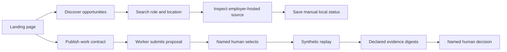

# A2Z Agent Hire UI: funnels and interaction contract

The local app has one responsive landing page and two distinct funnels. It uses real local API counts and explicit claim limits. It does not display fabricated customer logos, testimonials, worker quality scores, or conversion rates.

## Visual and interaction principles

- The hero states the product promise and the local-reference limit in the first viewport. Its orbital workflow illustration is CSS, not a remote asset or simulated performance chart.
- Two audience cards explain the shortest next step for talent and work owners. Their calls to action land on the actual working sections of the page.
- The system pulse reads only local API data: source-observed opportunity count, manual track count, and locally accepted outcome count.
- Source-observed postings link to an allowed employer-hosted Lever URL and show freshness. Search results show exact text-match reasons; no predictive match score is implied.
- Tracking uses a disclosure form with status, optional follow-up, and local note. The page warns that the loopback app is unauthenticated.
- Every job card exposes its current stage, applications, available action, evidence checklist, failure codes, and estimated economics. The displayed contribution is explicitly synthetic or user-declared.
- Every action is an inline form. There are no browser `prompt()` or `alert()` calls. Success and failure use a live-region toast.
- Escape all API-derived text before injecting HTML. Source links are allowed only on fixed Lever-hosted HTTPS domains.
- The page has a skip link, semantic sections, labels, focus indicators, keyboard-usable details and forms, and `prefers-reduced-motion` support. Motion conveys hierarchy but is not required to understand state.
- CSS and JavaScript are served from two fixed local asset paths. There are no remote fonts, image CDNs, or client dependencies.

## Responsive behavior

The desktop layout uses a two-column hero, opportunity grid, audience cards, and studio. Below 760px, the hero and major sections stack. Below 540px, search, opportunity, tracker, and worker cards become single-column; primary calls to action fill the width. The content and action order remain the same. Reduced-motion mode removes orbit, float, reveal, and hover transitions.

## Important limits

The interface is still a single-operator local reference. It has no candidate accounts, tenant separation, authenticated selectors or verifiers, artifact upload/attestation, autonomous agent execution, application submission to employers, reminders, settlement, or production monitoring. Landing-page polish does not change those boundaries.

## Browser verification

The local browser flow was exercised from a seeded source posting through keyword search and manual tracking. A synthetic job was taken through application, named selection, replay, two declared evidence records, and named acceptance. The final page displayed one local accepted outcome and the correct estimated economics.
